# Professional Coding Project - Example #1
<i>Because most of the code I've written remains proprietary, I created this page to showcase my experience indirectly via the output data visualizations. 
<i>Presented here: Data visualizations from a flow cytometry analysis pipeline written in R</i> 
<i>Pipelines Demonstration #2: [Cut-and-Run Seq](https://github.com/The1stMartian/Cut-And-Run-Seq-Demo)</i>

# Flow Cytometry Analysis (R)
Technical Overview:
- Investigation of chimeric antigen receptor NK cells (i.e. <b>CAR-NK cells</b>)
- Purpose: analyze the efficiency of CAR-NK cell creation
- Actual R code is proprietary (sorry)

| Library | Function |
| :------- | :------ | 
|flowCore | Creates the flowSet data type|
|flowAI|Automated qc|
| flowAssist | FlowFrame converter|
| flowCore | Apply function for flowsets|
| flowWorkspace | gatingSets, cytoSets |
| ggcyto | Autoplot function|
| ggplot2 | data visualization |
| openCyto | Automated culstering|
| ggpointdensity | Graphing|
| uwot | UMAP dimensionality reduction|
| cytofkit2 | Clustering|
| ggridges | Fluorescence density plots|
| flowStats | DataFrame to flowFrame converter|

## General Schema:
- QC: Raw fluorescence batch comparison
- QC: Fluorescence normalization (gaussNorm)

Gating:
- Non-debris gating
- Singlet gating
- Live cell gating 
- Marker gating (CD45+ > ...)

### Step 1: Raw Batch comparison 
- Examine all markers at the same time for a broad overview of the dataset 
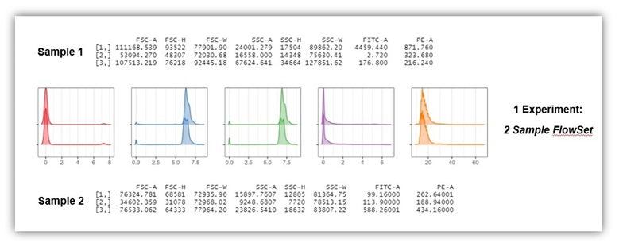

### Step 2: Fluorescence normalization by warpSet or gaussNorm:
- With multiple samples (each row) it becomes increasingly important to normalize fluorescence distributions prior to gating 
- In this comparison, gaussNorm performed best 
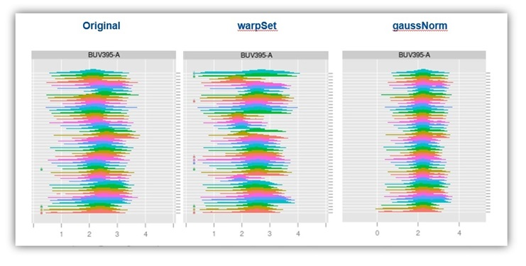

### Step 3: Large Debris Removal:
- Standard removal of non-cell datapoints 
- In this example, I didn't remove the smaller debris as later analysis indicated they were actual cells. 
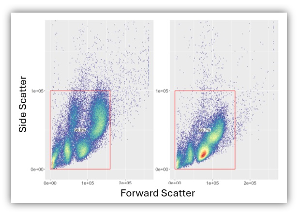

### Step 4: Singlet Gating:
- Standard removal of cell doublets 
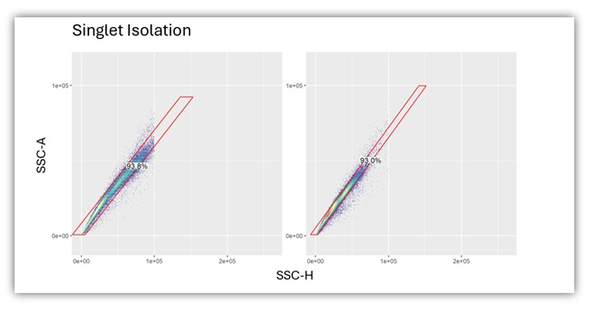

### Step 5+: CD45+ gating for lymphocytes and subsequent two-color gating:
- Multiple gating steps use 2D gates 
- This is an example of multiple gates applid to the same set of cells 
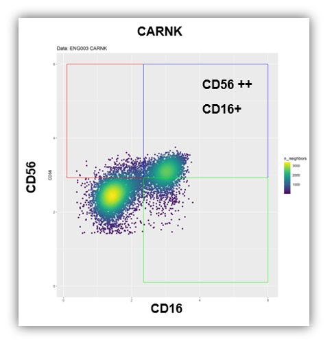

### Gating with Multiple Samples:
- Example of reproducibility of the gating strategy across 46 samples 
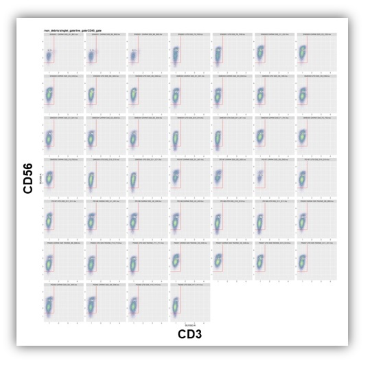

### Dimensionality Reduction: tSNE (colors by cluster)
- I tried dimensionality reduction with two different algorithms to see which performed better in terms of computation and distinguishing cell clusters (calculated separately of course). UMAP performed better than tSNS, in accordance with various reports.  
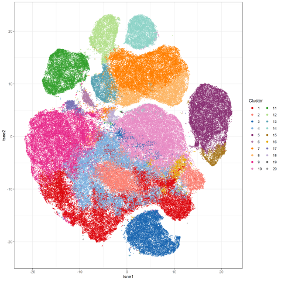

### Dimensionality Reduction: UMAP (colors by cluster)
- UMAP projection of the same set of cells 
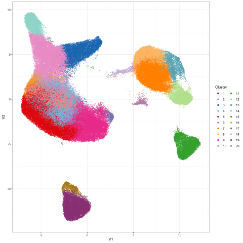

### Gene expression investigation (UMAP)
- To help identify/verify groups of cells, I colored the UMAP projections according the the level of various cell surface markers.  
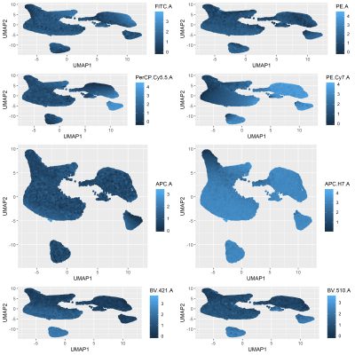

### Cluster Identification via Gene Expression Heat Map
- Clustered heat maps cah help show the similarities/differences between clusters 
- This plot is marked by cell surface marker, though those would normally be replaced by the corresponding gene label 
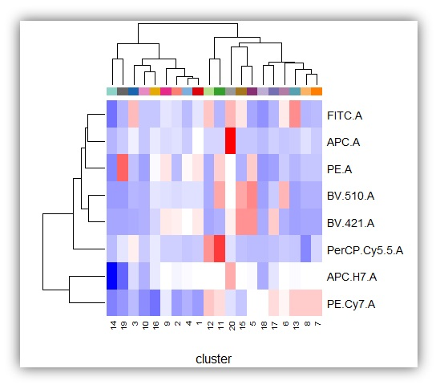

### Schema:
- The cells we were examining were immunologically naive. Accordingly, there were few highly differentiated cells, necessitating a "flat" gating scheme. 
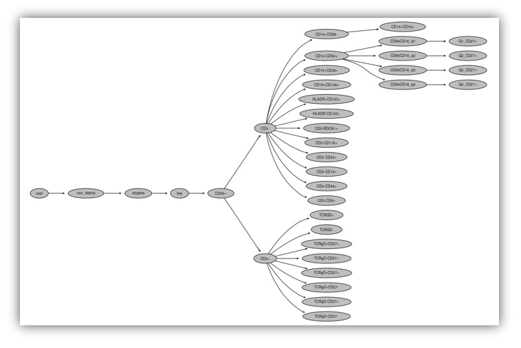

## Outputs:
- The general concept in FC analysis is to use a combination of dimensionality reduction and clustering to identify groups of cells in an automated fashion. Next, users typically do a custom analysis of the limited number of cell surface markers to manually assign cell types to each cluster. The program then reports on the number of cells passing each gate, providing quantitative metrics on the experiment.